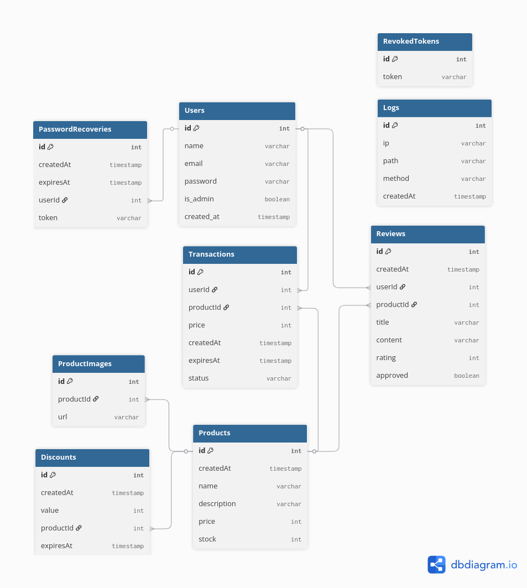

# Store API

## Project Description

**Store API** is a backend service built with Express.js and TypeScript to manage an online store. It provides endpoints for users, products, transactions, reviews, discounts, and product images, as well as for processing payments through **Mercado Pago** (only Pix for now). The API uses Prisma ORM to interact with a PostgreSQL database, supporting features like authentication, authorization, and file uploads.

The database schema includes the following models:
- **Users** – manages users and admin privileges.
- **PasswordRecoveries** – handles password reset tokens.
- **RevokedTokens** – stores invalidated JWTs.
- **Logs** – tracks user requests and actions.
- **Products** – main products with details, stock, and relationships to discounts, images, transactions, and reviews.
- **Discounts** – manage product discounts with expiration dates.
- **ProductImages** – store product images.
- **Transactions** – track user purchases and their statuses.
- **Reviews** – manage user reviews and approval workflow.
- **TransactionStatus** – enum defining possible transaction states.

---

## Features
- **Authentication & Authorization** with JWTs
- **Admin and user roles** for protected routes
- **CRUD operations** for products, discounts, transactions, reviews, and images
- **File uploads** for product images using Multer
- **Pagination** support for large datasets
- **Password recovery workflow**
- **Logging** of requests for monitoring
- **CRON Job** to cleanup revoked tokens every sunday

---

## Tech Stack

### Core
- **Node.js** & **Express.js** – Server and routing framework  
- **TypeScript** – Type-safe development  
- **Prisma ORM** + **PostgreSQL** – Database modeling and queries  

### Authentication & Security
- **JWT (jsonwebtoken)** – Token-based authentication  
- **bcryptjs** – Password hashing and verification  
- **cookie-parser** – Parse cookies  
- **express-rate-limit** – Limit request rates  
- **xss** – Sanitize input and prevent XSS attacks  

### Utilities
- **dotenv** – Load environment variables  
- **uuid** – Generate unique identifiers  
- **Multer** – Handle file uploads  
- **node-cron** – Schedule automated tasks  

### Development
- **ts-node-dev** – Hot-reload TypeScript server during development  

### Integrations
- **Mercado Pago** – Payment processing

---

## Scripts
- `npm run dev` – start the development server with hot reload
- `npm run build` – compile TypeScript to JavaScript
- `npm start` – run the compiled server

---

## Environment Variables
- `DATABASE_URL` – PostgreSQL connection string
- `JWT_SECRET` – secret key for signing JWT tokens
- `PORT` – the port where the server is going to run
- `MERCADOPAGO_ACCESS_TOKEN` - access token to process MP payments

---

## API

### Overview

- `/api/users` – manage users
- `/api/products` – manage products
- `/api/product/images` – upload/delete product images
- `/api/transactions` – track purchases
- `/api/reviews` – manage user reviews
- `/api/discounts` – manage product discounts
- `/api/auth` – login, logout, password recovery

### Users endpoints

Base URL: `/api/users`

All routes require authentication. Admins have full access; regular users can access or modify only their own user record.

#### Get all users

**Endpoint:** `GET /api/users`  
**Permissions:** Admin only  

**Description:** Retrieve a list of all users (name, email, created date).

**Errors:**
- 403 Forbidden if the user is not an admin.

#### Get a single user

**Endpoint:** `GET /api/users/:id`  
**Permissions:** Admin or the user themselves  

**Description:** Retrieve a single user by ID.

**Errors:**
- 403 Forbidden if the requester is not an admin and tries to access another user's data.
- 404 Not Found if the user does not exist.

#### Update a user

**Endpoint:** `PUT /api/users/:id`  
**Permissions:** Admin or the user themselves  

**Description:** Updates user’s name, email, and password. Admins can update any user without providing the current password; regular users must provide the correct current password.

**Errors:**
- 403 Forbidden if the requester is not authorized.
- 403 Email already exists if another user already has the provided email.
- 403 Current password is incorrect if a regular user provides the wrong password.

#### Delete a user

**Endpoint:** `DELETE /api/users/:id`  
**Permissions:** Admin or the user themselves  

**Description:** Deletes a user account.

#### Notes
- All endpoints require a valid authentication token.
- Admins have unrestricted access to all users.
- Regular users can only access, update, or delete their own account.
- Passwords are stored encrypted and never returned in lists.
- HTTP status codes used:
  - 201 for successful operations (create/update/delete)
  - 403 for forbidden actions
  - 400 for bad requests
  - 404 if a resource is missing

### Transactions endpoints

Base URL: `/api/transactions`

All routes require authentication. Admins have full access.

#### Get all transactions (paginated)

**Endpoint:** `GET /api/transactions`  
**Permissions:** Admin only  

**Description:** Retrieve a paginated list of all transactions. Defaults to 10 items per page.

**Query Parameters:**
- `page` (optional, default = 1) – page number

**Response:**
- JSON object with `transactions` array and `total` count

**Errors:**
- 403 Forbidden if the user is not an admin.

#### Get a single transaction

**Endpoint:** `GET /api/transactions/:id`  
**Permissions:** Admin only  

**Description:** Retrieve a single transaction by ID.

**Response:**
- JSON object with transaction details

**Errors:**
- 403 Forbidden if the user is not an admin.
- 404 Not Found if the transaction does not exist.

#### Create a transaction

**Endpoint:** `POST /api/transactions`  
**Permissions:** Admin only  

**Description:** Create a new transaction.

**Request Body:**
- `productId` (integer) – ID of the product  
- `userId` (integer) – ID of the user  
- `price` (integer) – transaction price  
- `expiresAt` (ISO 8601 string) – expiration date

**Response:**
- `{ "message": "Transaction created" }`

**Errors:**
- 403 Forbidden if the user is not an admin.

#### Update a transaction status

**Endpoint:** `PUT /api/transactions/:id`  
**Permissions:** Admin only  

**Description:** Update the `status` field of a transaction.

**Request Body:**
- `status` (string) – new status value

**Response:**
- `{ "message": "Transaction updated" }`

**Errors:**
- 403 Forbidden if the user is not an admin.
- 404 Not Found if the transaction does not exist.

#### Notes
- All endpoints require a valid authentication token.
- Admins have unrestricted access to all transactions.
- Pagination uses `page` query parameter with 10 items per page.
- `expiresAt` should be a valid ISO 8601 date string.
- HTTP status codes used:
  - 201 for successful operations (create/update)
  - 403 for forbidden actions
  - 404 if a resource is missing

### Reviews endpoints

Base URL: `/api/reviews`

All routes require authentication. Admins have full access; regular users can create, update, or delete their own reviews if they have completed the transaction.

#### Get all reviews (paginated)

**Endpoint:** `GET /api/reviews`  
**Permissions:** Admin only  

**Description:** Retrieve a paginated list of all reviews. Defaults to 10 items per page.

**Query Parameters:**
- `page` (optional, default = 1) – page number

**Response:**
- JSON object with `reviews` array and `total` count

**Errors:**
- 403 Forbidden if the user is not an admin.

#### Get a single review

**Endpoint:** `GET /api/reviews/:id`  
**Permissions:** Admin only  

**Description:** Retrieve a single review by ID.

**Response:**
- JSON object with review details

**Errors:**
- 403 Forbidden if the user is not an admin.
- 404 Not Found if the review does not exist.

#### Create a review

**Endpoint:** `POST /api/reviews`  
**Permissions:** Users with a completed transaction for the product  

**Description:** Create a review for a product. User must have a completed transaction for the product.

**Request Body:**
- `title` (string) – review title  
- `content` (string) – review content  
- `rating` (integer) – rating value  
- `productId` (integer) – ID of the product

**Response:**
- `{ "message": "Review created" }`

**Errors:**
- 403 Forbidden if the user has no completed transaction for the product.

#### Update a review

**Endpoint:** `PUT /api/reviews/:id`  
**Permissions:** Review owner  

**Description:** Update your own review.

**Request Body:**
- `title` (string) – review title  
- `content` (string) – review content  
- `rating` (integer) – rating value  
- `productId` (integer) – ID of the product

**Response:**
- `{ "message": "Review updated" }`

**Errors:**
- 403 Forbidden if the user is not the owner of the review.

#### Delete a review

**Endpoint:** `DELETE /api/reviews/:id`  
**Permissions:** Review owner or admin  

**Description:** Delete a review.

**Response:**
- `{ "message": "Review deleted" }`

**Errors:**
- 403 Forbidden if the user is not the owner or an admin.

#### Approve a review (admin only)

**Endpoint:** `PATCH /api/reviews/approve-review/:id`  
**Permissions:** Admin only  

**Description:** Approve a review to make it publicly visible.

**Response:**
- `{ "message": "Review created" }`

**Errors:**
- 403 Forbidden if the user is not an admin.

#### Notes
- All endpoints require a valid authentication token.
- Only users with completed transactions can create reviews.
- Pagination uses `page` query parameter with 10 items per page.
- HTTP status codes used:
  - 201 for successful operations (create/update/delete/approve)
  - 403 for forbidden actions
  - 404 if a resource is missing
